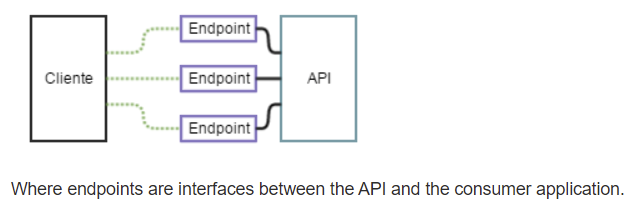

# END - POINT ?
> An endpoint is simply **one end of a communication channel**



- API 가 RESTful API를 인터페이스를 통해 서버의 리소스에 액세스 할 수 있게 해주는 URL
- 구성
	- HTTP 메서드
	- URL 경로
	- 경로 변수 및 쿼리 매개변수

</br>

---
# IAM (AWS Identity and Access Management)
> AWS 리소스에 대한 접근 제어하는 서비스
> 누구에게 어떤 접근 권한 부여할지 설정 가능

</br>

## 어떤걸 하는 서비스?
- __사용자__ 생성 및 관리
	- AWS 리소스 접근 가능한 사용자 계정 생성 및 관리
- __그룹__ 생성 및 관리
	- 비슷한 권리 필요한 사용자들을 그룹으로 묶어 관리
- __역할__ 생성 및 관리
	- 특정 작업을 수행할 권한을 역할 단위로 부여 및 사용자와 서비스에 할당
- __정책__ 작성 및 적용
	- JSON 형식 정책 문서 작성 및 사용자, 그룹, 역할에 대한 세밀한 권한 정의

</br>

## 이점은?
- 보안 강화 + 세밀한 권한 제어
	- 최소한의 권한만 부여해 보안 사고 줄임
- 관리 편리성
	- 중앙에서 권한 관리
	- 사용자 그룹 통해 여러 사용자에게 동일 권한을 일괄적으로 부여 가능
- 유연한 역할 관리
	- 역할 기반 접근 제어 통해 다양한 서비스와 사용자 간 권한위임 쉽게 설정 가능
- 규정 준수
	- 접근 제어 및 감사 기능을 통해 컴라이언스 요구 사항 충족 가능
	- 컴플라이언스?
		- 기업 경영이 법령, 규정, 윤리 또는 사회통념에 맞도록 하는 내부통제 장치

</br>

> [!check] 권한 설정
> - 서비스에 대한 모든 권한 부터 최소 단위 까지 다양한 범위로 설정 가능함
> - 수업 실습 시간 때는 편리를 위해 Full 권한을 주었지만
> - 실제 사용할 때는 필요한 최소 권한만 설정해 관리하는 것이 좋음!

</br>

> [!check] IAM 사용자 = 한 사람?
> - 사용자라는 용어 때문에 한 사용자가 한 사람이라 생각할 수 있음
> - 하지만, IAM 사용자는 권한(목적) 에 따라 나눠놓은 것 뿐 한 사람이 아님!!

</br>

## 실습 해보기 !

</br>

### 사용자
1. 사용자 기본 정보 설정
	

2. 권한 설정
	- 그룹에 추가 / 직접 연결 / 기존 사용자의 권한 복사 
		

</br>

### 그룹
1. ㅇㅣ름 및 사용자 추가
	

2. 권한 정책 설정
	

### 정책
1. 권한 지정
	- version
		- 정책 언어 버전
	- statement
		- 하나 이상의 문으로 구성
		- 각 문은 효과, 작업, 리소스 및 조건 정의
	- effect
		-  문서의 효과 명시 (value = Allow, Deny)
	- action
		- 어떤 작업에 대해 적용할 지 정의
	- resource
		- 작업 적용될 리소스 명시
	- condition
		-  특정 조건 하에 문을 적용하는 선택적 요소
	

2. 검토
	


</br>

---
# AWS CLI (AWS Command Line Interface)
> AWS 서비스를 관리하기 위해 CLI를 제공하는 도구
> AWS에서 제공하는 모든 기능을 명령으로 수행 가능

</br>

## 장점
- 자동화
	- 반복적인 작업을 스크립트로 자동화 가능
	- DevOps 및 CI/CD 파이프라인에 유용
- 효율성
	- 대량 리소스 관리
	- 대규모 배포 신속하게 수행 가능
- 일관성
	- 명령줄 스크립트 및 코드 사용해 AWS 환경을 일관되게 설정 및 관리 가능
- 편리성
	- 빠르게 AWS 리소스 생성, 수정, 삭제 작업 가능
- 복잡한 작업 처리
	- 콘솔에서 수행하기 어려운 복잡한 작업을 쉽게 처리 가능

## 사용 사례
- 인프라 관리
	- 인스턴스 생성, 시작, 중지, 종료 등 인프라 리소스 관리 가능
- 배포 자동화
	- S3 버킷에 파일 업로드나, Lambda 함수 배포 등 작업 자동화 가능
- 모니터링 및 로그 관리
	- CloudWatch 로그 조회, 특정 기간 동안의 성능 데이터 수집 가능
- DB 관리
	- RDS 인스턴스 백업 및 복구, 스냅샷 생성등 자동화 가능
- 보안 관리
	- IAM 사용자, 그룹 및 역할 생성 및 관리 가능

</br>

## 실습 해보기 !

</br>

### CLI 설치
- window
	- `https://awscli.amazonaws.com/AWSCLIV2.msi` 파일 설치
- macOS
	- 터미널에서
	- `curl "https://awscli.amazonaws.com/AWSCLIV2.pkg" -o "AWSCLIV2.pkg"`
	- `sudo installer -pkg AWSCLIV2.pkg -target /`
- Linux
	- 터미널에서
	- `curl "https://awscli.amazonaws.com/awscli-exe-linux-x86_64.zip" -o "awscliv2.zip"`
	- `unzip awscliv2.zip`
	- `sudo ./aws/install`

- 완료 후,  `aws --verison` 으로 확인

</br>

### 액세스 키 발급
> IAM 사용자로 이용하기 위해서 액세스키 무조건 필요함!

1. 사용처 선택
	
	

2. 발급 및 키 저장
	
	

### 기본 설정 + 프로파일 설정
- `aws configure` 명령어 사용
- 액세스 키 + region + format 설정
- 이때, `--profile [프로파일명]` 옵션을 주면 프로파일 추가 가능
- .aws 디렉토리에서 `type config` 로 추가된 프로파일들 확인 가능

### 기본 명령어
- `aws <service> <command> [subcommand] [parameters]`

- __service__ : aws 서비스
- __command__ : 수행할 작업 (list, create, delete...)
- __subcommand__ : 하위 추가 명령어
- __parameter__ : 전달할 매개변수

> [!check] 허용되지 않는 접근!
> - 권한을 주지 않은 접근에 대해서 에러 발생!
> - 사용을 원하면 직접 추가해 줘야함!


- 예시
```shell
aws s3 ls
aws s3 ls --profile lion

*버킷*
aws s3 mb s3://my-new-bucket
aws s3 cp myfile.txt s3://my-new-bucket/
aws s3 cp s3://my-new-bucket/myfile.txt .
aws s3 rb s3://my-new-bucket --force

*EC2*
aws ec2 describe-instances
aws ec2 stop-instances --instance-ids i-0abcdef1234567890
aws ec2 start-instances --instance-ids i-0abcdef1234567890
aws ec2 terminate-instances --instance-ids i-0abcdef1234567890

```