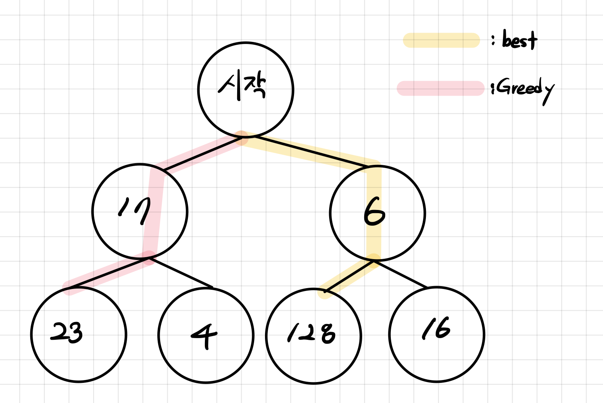
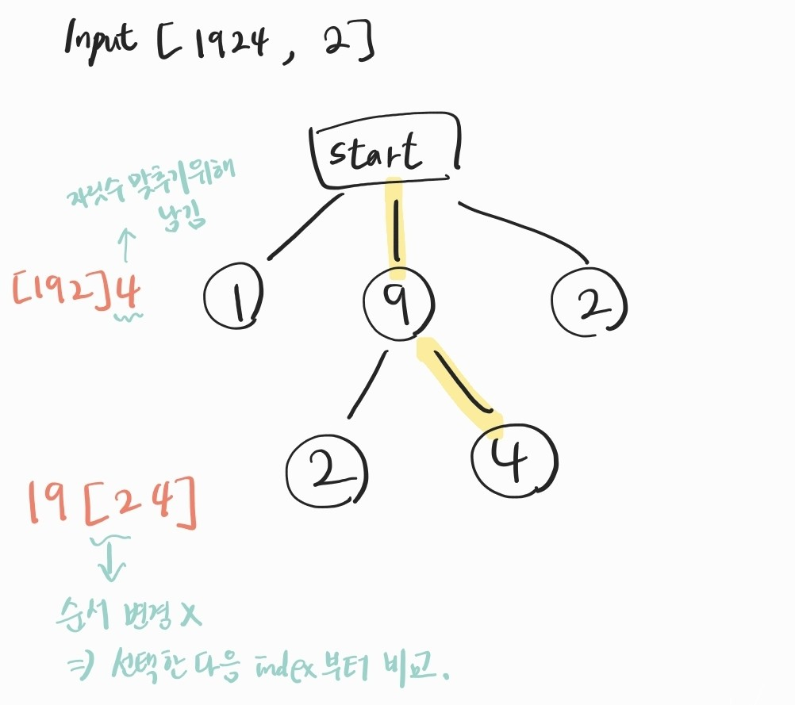

# Greedy (탐욕 알고리즘)
> 각 단계에서 최적이라고 생각되는 것을 선택해 나가는 방식
> 최적의 값을 보장하는 것이 아닌 최적의 값의 __근사값__ 을 목표로 함



</br>

## 그리디 알고리즘 조건

### 탐욕스러운 선택 조건
> 해당 문제가 그리디를 이용해 최적해를 반드시 도출할 수 있음이 보장되어야 함

</br>

### 최적 부분 구조 조건
> 문제에 대한 최종 해결 방법이 부분 문제에 대해서도 최적의 해결 방법이여야 함

- 전체 문제의 여러 단계 하나 하나에 대해서 최적해가 도출되어야함

</br>

---
# 큰 수 만들기
[프로그래머스 큰수 만들기 코테](https://school.programmers.co.kr/learn/courses/30/lessons/42883)

### 문제 해결 방법
- 최소 필요한 자리수 만큼만 남기고 앞쪽부터 가장 큰수 찾기

</br>

### 코드
```java
class Solution {
    public String solution(String number, int k) {
        String answer = "";
        
        int startIdx = 0;
        for(int i = k; i < number.length(); i++){
            char max = 0;
            int maxIdx = 0;
            
            for(int idx = startIdx; idx <= i; idx++){
                if(number.charAt(idx) > max){
                    max = number.charAt(idx);
                    maxIdx = idx;
                }
            }
            startIdx = maxIdx + 1;
            answer += max;
        }
        
        return answer;
    }
}
```

</br>

### 설명
 

---
- 참고 사이트
  [greedy 참고 사이트](https://velog.io/@contea95/%ED%83%90%EC%9A%95%EB%B2%95%EA%B7%B8%EB%A6%AC%EB%94%94-%EC%95%8C%EA%B3%A0%EB%A6%AC%EC%A6%98)
  