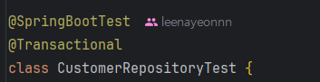
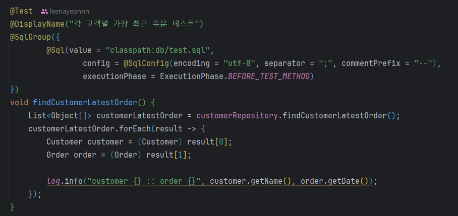
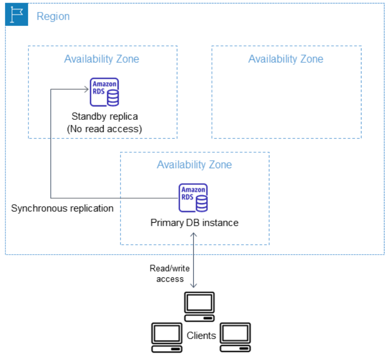
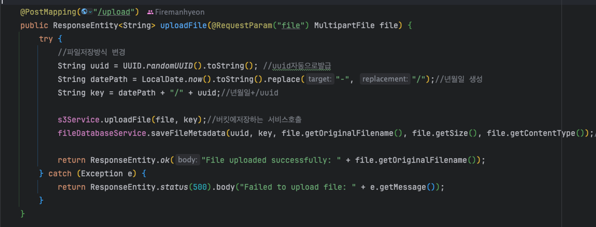
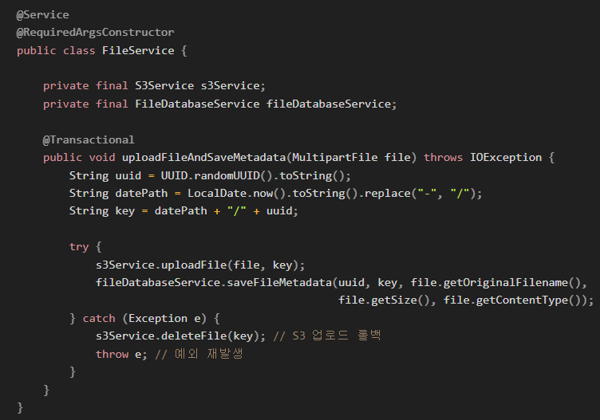

# 0603 : 나연님
> Test시 발생할 문제 하나를 미리 알아봐요!

 

### @Transactional 와 @Sql을 같이쓸 때 주의할 점!
> 수업시간에 테스트 메서드 실습 중
> 밑에 제시되 있는 테스트 코드를 추가하고 전체 테스트 진행시
> __원래 성공하던 find 관련 메서드가 실패가 되는 문제__ 가 생겼습니다...

 

 

#### 왜 문제가 생겼을까? 🤔
> - 테스트 코드에서 @Transactional을 지정해 놓으면 내용이 DB에 반영 X = 롤백이 기본 설정
> - 하지만, Sql문에 __DDL__ 에 대한 내용이 있다면?
> 	- DDL은 Auto-Commit 되는 sql 문으로 롤백이 불가능함
> 	- 따라서, 여러 테스트를 한번에 수행할 때
> 	  DDL 구문이 들어간 SQL 스크립트를 불러 실행하면 문제가 생길 수 있기에 주의해서 사용
> 	   
> - ex : 내가 겪은 오류
> 	- 위 테스트 메서드에서 BEFORE_TEST_METHOD 옵션으로 sql 수행
> 	- 이때, sql문은 테이블을 drop 하고 다시 create 진행 후 레코드 삽입함
> 	- DDL의 특성으로 테이블이 재생성 되지만
> 	  @Transactional로 레코드(데이터)는 롤백되어 해당 테스트가 종류된 후 테이블에 저장되지 않음
> 	- 따라서, 이후에 수행된 find 메서드에서 찾을 수 있는 데이터가 없어 테스트 실패가 뜸

 

---
# 0611 ~ 12 : 혜빈님, 혜진님
> 지출이 두려워도 함부로 건들지는 말아요..!

 

### 서브넷을 지워보았다...!!
> 실습을 끝내고 인스턴스를 중지하고 삭제하면서,
> __어떤 인스턴스가 서브넷에 연결만 되어있어도 요금이 나간다__ 는 !!! 충격적인 이야기를 들었습니다.
> 
> 헉 싶었던 찰나... 서브넷을 한번 삭제해보고 싶다는 충동에 사로잡혀 __1개만 남겨두고 모두 지워보았는데__
> (1개는 무조건 존재해야 한다고 못지우더라고요 😹)
> 참고로 건드리지 않은 초기 상태에서 서울 리전의 AZ a,b,c,d에 각각 하나씩 총 4개의 서브넷이 있었습니다.
> 
> 그리고 그 다음날... __RDS를 생성하며 문제__ 가 생겼습니다.. ^-^

 

#### 에러 발생 🚨
> RDS 생성시
> `The DB subnet group doesn't meet Availability Zone (AZ) coverage requirement. Add subnets to cover at least 2 AZs`
>  라는 에러 메세지가 출력되었다....
> 
> 그래서 __서브넷을 다시 추가__ 하여 정상적으로 RDS를 생성할 수 있었다 !!
> (혜진님은 다시 계정을 만들었다고 합니다... 😢)

 

#### 그래서 왜 2개의 서브넷이 필요했을까? 🤔
> 그것은 바로 __Failover__ 을 위해서 였다...!
> 
> RDS는 생성 시 다중 AZ 배포 옵션이 있는데,
> 이를 통해 기존 운영 인스턴스가 되는 primary 인스턴스와 failover 목적으로 대기를 시킬 대기 인스턴스(standby)가 있다. 이때 대기 인스턴스는 primary가 존재하는 AZ와는 다른 AZ에 생성된다.
> 
> 운영중인 primary가 이상이 생길 시, RDS는 자동으로 standby 인스턴스로 failover를 시도한다.
> failover가 되면, 기존 primary가 가지고 있던 접속 정보를 그대로 물려받는다.
> 
> 출처 : 유준님의 발표자료

 

 

#### 결론은?💡
> 돈이 아깝다고 함부로 아무거나 지우지 말자
> 사서 고생한다...

 

---
# 0613 : 호현님

 

### 버킷에 파일 업로드 및 DB에 정보 저장시 오류가 나면?
> 버킷에 파일 업로드 하는 실습 중 갑자기 떠오른 의문점 하나
> __2개 로직 중 하나만 예외가 발생하면 데이터 일관성이 깨지지 않을까..?__
> (파일은 버킷에 업로드 되었는데 DB에 정보를 저장할 때 예외가 발생해 저장이 안되었다 등...)

 

#### 어떻게 해결하면 좋을까? 🤔
> __제안 1__
> 버킷 저장 기능과 DB 저장 기능을 하나의 서비스로 묶고 @transactional을 서비스에 붙이기
> 
> 기각..
> S3 업로드는 데이터베이스 트랜잭션과는 별개의 작업으로,
> @Transactional이 S3 업로드에 직접적인 영향을 주지 않는다.
> 따라서 데이터베이스 트랜잭션이 롤백되더라도 S3에서 이미 업로드된 파일을 자동으로 삭제하지 않는다.
> 
> __제안 2__
> 컨트롤러에 @Transactional을 붙여준다.
> 
> 기각..
> 제안 1과 마찬가지로 S3 업로드된 파일에 대한 삭제 작업이 이뤄지지 않음
> 또한, 컨트롤러에 비즈니스 로직을 담는 것을 좋지 않기에 @transactional을 붙이는 것은 부적절하다 판단.
> 
> __제안 3__
> catch문에 예외가 발생했을 시 롤백하는 로직을 추가
> 
> 채택..
> 예외 처리 및 롤백 로직을 명확하게 정의해서 S3 업로드와 DB 저장 간 일관성 유지 가능하다 판단

 

 

#### 더 괜찮은 방법이 있을까? 🫵
> 혹시 이 문제에 대한 다른 생각이 있다면
> [회고 8팀 질문](https://www.notion.so/likelion/0613-0831314afd4a416f9617c0a5d3c620fb)
> 여기에 댓글을 달아주세요!